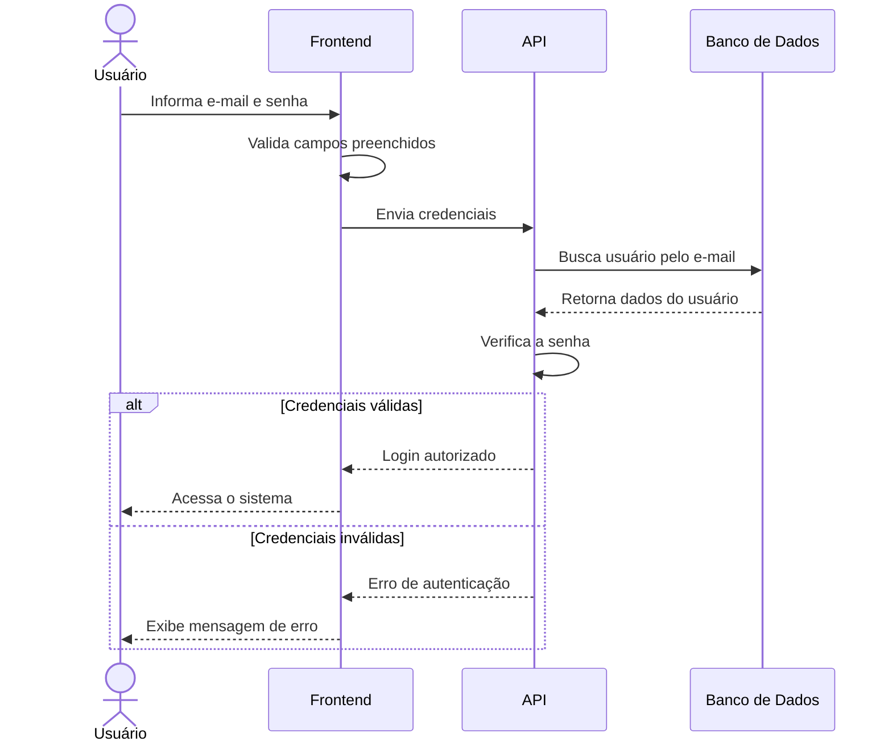

# Diagrama de Sequência - Login

```mermaid
sequenceDiagram
    actor U as Usuário
    participant F as Frontend
    participant A as API
    participant B as Banco de Dados

    U->>F: Informa e-mail e senha
    F->>F: Valida campos preenchidos
    F->>A: Envia credenciais
    A->>B: Busca usuário pelo e-mail
    B-->>A: Retorna dados do usuário
    A->>A: Verifica a senha

    alt Credenciais válidas
        A-->>F: Login autorizado
        F-->>U: Acessa o sistema
    else Credenciais inválidas
        A-->>F: Erro de autenticação
        F-->>U: Exibe mensagem de erro
    end
```
